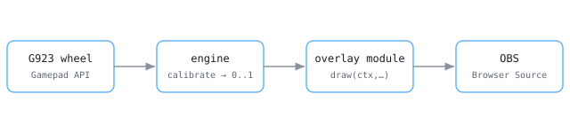

# Stream Overlays

[](https://github.com/dberardi2020/stream-overlays/actions/workflows/tests.yml)


Browser **overlays for streamers** that read your hardware in the browser and composite over your scene in **OBS**. Everything is a **static file** and every setting lives **in the URL**, so there is no install, no account, and nothing to host but plain files. The first vertical is **sim racing** — live **throttle / brake / clutch / steering / gears** from a **Logitech G923**, drawn as a catalogue of small canvas overlays.


**[Open the gallery →](https://dberardi2020.github.io/stream-overlays/pages/gallery.html)**  ·  **[Calibrate your wheel →](https://dberardi2020.github.io/stream-overlays/pages/setup.html)**

**69 overlays, all animating over a built-in demo lap** — so the gallery is worth opening with no hardware attached. Pedals, wheel, H-shifter and paddles are bound and verified against a real G923.

## How it works



The **Gamepad API is client-side**, so the browser on your machine reads your wheel and hands the values straight to the page. There is no server in the path and no telemetry leaving your PC — which is also why the whole thing can be plain static files.

## Model, in five words

- **Overlay** — one canvas renderer, selected by its **immutable id**: `?style=bowtie`. Ids are never
  reused or renumbered, so a URL you pasted into OBS keeps working.
- **Channel** — one normalised input value in `0..1`: `thr`, `brk`, `clu`, `str`, plus gear. Calibration
  turns whatever your hardware reports into these; overlays only ever see channels.
- **Set** — which channels an overlay is *about*: `pedals`, `wheel`, `shifter`, or `combo`. Derived from
  the draw code, not hand-typed.
- **Stage** — how finished it is: `live`, `draft`, `experimental`, or `excluded` (archived, not deleted).
- **Manifest** — `catalogue.json`, the single source of truth for every overlay's id, name, size, set,
  stage, channels and plate. Tests verify it against the modules rather than trusting it.

## Requirements

- **OBS** (or any browser) for display, and a **wheel** for live input. Without one, everything still
  runs on the built-in demo lap.
- Nothing else — no install, no account, no download. The site is hosted.

## Use it

In order:

1. Open **[setup](https://dberardi2020.github.io/stream-overlays/pages/setup.html)** and calibrate your wheel.
2. Browse the **[gallery](https://dberardi2020.github.io/stream-overlays/pages/gallery.html)** and pick an overlay.
3. Hit **Copy OBS link**.
4. In **OBS**, add a **Browser Source** at that URL, at the size the card shows.

Config lives entirely in the URL — `?style=<id>&scale=<n>` plus optional plate settings `&bg=&bga=&radius=&edge=` — so a configured overlay is just a link you paste, and nothing is stored server-side because there is no server. Overlay **ids are immutable**, so a link you paste into OBS keeps working; that is also why a future move off this host cannot change a single `?style=` URL ([ADR 0002](docs/decisions/0002-static-first-hosting.md)).

**Calibration is per browser.** OBS ships its own browser with its own storage, so calibrating in Chrome does *not* carry over — do it once more inside OBS via right-click → **Interact**. The setup page walks through this.

## Run it locally

Only needed to develop — the Gamepad API and ES modules both need an HTTP context, so opening the files
over `file://` will not work:

```sh
git clone https://github.com/dberardi2020/stream-overlays.git
cd stream-overlays
npm run serve   # finds python3 / py / python, whichever this machine has
# then open http://localhost:8000/pages/gallery.html
```

The dev server's document root is `overlays/sim-racing/`, the same directory the deploy publishes, so
every path is identical local and live.

If you point OBS at a `localhost` URL instead of the hosted one, that server has to be running whenever OBS loads the source — otherwise the overlay is blank. On Windows, `scripts/start-overlays.cmd` starts it; a shortcut in `shell:startup` keeps it up. The hosted links have no such requirement.

### Hand it to your coding agent

```
Clone https://github.com/dberardi2020/stream-overlays and read docs/README.md.
Serve overlays/sim-racing over HTTP and open pages/gallery.html.
Then walk me through adding a new overlay: a module in overlays/sim-racing/overlays/
that exports `id` + `draw(ctx,w,h,state,mem)`, plus its catalogue.json entry — and
run `node --test tests/*.test.mjs` and pytest so the blank-tile and manifest guards pass.
```

## Overlays

Every overlay is a small canvas renderer selected by its immutable id: `?style=<id>`. The manifest owns the metadata; a module owns the drawing.

`catalogue.json` holds **73 entries**; the **69** that are not `excluded` each have a module, and every one of them is pixel-checked against a golden render (see [Testing](#testing)).

| id | Reads | What it shows |
| --- | --- | --- |
| `bowtie` | brake · throttle · clutch | Brake left, throttle right, from a shared centre line — overlap is obvious. |
| `dot-ladder` | brake · throttle · clutch | Ten dots per channel; reads at tiny sizes and survives stream compression. |
| `wheel` | steering | A flat-bottomed GT rim with real spokes and a top-dead-centre marker. |
| `gate-map` | gear | The H-pattern gate with the engaged gear lit — needs a real H-shifter. |
| `dash-cluster` | all channels | The classic: rev arc + gear centre, pedals and wheel around it. |
| *…64 more* | pedals · wheel · shifter · combos | [Browse them all](https://dberardi2020.github.io/stream-overlays/pages/gallery.html), animated over a demo lap. |

Overlays are grouped by **set**, and both `set` and the exact channels an overlay reads are **derived from its draw code** and verified against the manifest — see [`docs/technical`](docs/technical/README.md).

Overlays whose subject *is* gear position declare `requires: gear:absolute` and stand down when only paddles are calibrated, because paddles report a shift *direction*, never which gear you are in ([ADR 0007](docs/decisions/0007-gear-sources-are-independent.md)).

## Testing

Three layers — the two deterministic ones gate every change:

- **Unit** — `node --test tests/*.test.mjs` (calibration maths, gear motion, and a blank-tile guard that runs every overlay against a mock canvas) and `pytest tests/` (manifest schema, `set`-vs-`uses`, and module↔manifest coherence).
- **Acceptance** — `node qa/acceptance.mjs` renders every overlay in real headless Chromium and **pixel-diffs it against a golden**, so a rendering regression fails the build, not the stream. Needs `npm i && npx playwright install chromium`; skips cleanly when a browser is absent.
- **Agentic browser pass** — dev-only, driven live per [`qa/product-map.md`](qa/product-map.md).

Goldens have two provenances and are not the same guarantee: 40 come from the original prototype and prove the port is faithful to it, while 29 were re-baselined from the modules after those overlays deliberately diverged. [`docs/technical/testing.md`](docs/technical/testing.md) has the detail, the coverage, and the known gaps.

## Roadmap

The engine, overlay library, calibration, gallery and landing page are done and hardware-verified, and the site deploys to GitHub Pages from `main` (SO-0008). What remains:

- An **overlay quality pass** — cull the half-baked, upgrade the rough (SO-0019).
- A **real domain**, so the links outlive the host choice (SO-0008).
- **Sim telemetry** (rpm, speed, gear-from-sim), deferred until there is a feed to read — those overlays run on demo data until then (SO-0007).
- Longer-term, a **builder** that composes overlays from named sub-visuals — which the module architecture is shaped to enable (SO-0011).

## Documentation

Full docs live in [`docs/`](docs/README.md):

- **[Product](docs/product/README.md)** — what it is, who it's for, and the vocabulary above in full.
- **[Technical](docs/technical/README.md)** — the layered architecture, the overlay module contract, and how the manifest stays honest.
- **[Decisions](docs/decisions/README.md)** — the ADRs: config-in-the-URL, static-first hosting, the OBS fallback, the stack, the module contract, and why the two gear sources are independent.
- **[Tickets](docs/tickets/tickets.md)** — the backlog, and the record of how each piece was decided.

## License

[MIT](LICENSE) © Dimitri Berardi
